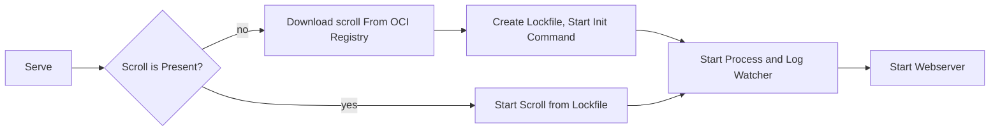

# Introduction

## General

This is the documentation for [druid-cli](https://github.com/highcard-dev/druid-cli), a open source tool for process managing and process insight.
It is recommended, but not manditory to use the druid-cli inside a container, to ensure all the coditions are meet for the process.
Simpler setups should also work without containers.

Processes and process structures **are called scrolls**.
A scroll is an OCI Artifact, wich you can store in any OCI registry, like Dockerhub.

## Architecture



A command can depend on the success of a different command. You can see more in the [scroll section](/cli/scroll).

## Installation

At the moment druid-cli is test within different Linux Distributions and MacOS. We do not ship any Windows binaries, it may be possible to compile them on your own, but it's not officialy supported. **Windows support is planed for the future.**

### Using Docker

Using docker is probably the easiest way to get started.
There are several docker images available.

Example

```bash
docker run highcard/druidd-ubuntu registry-1.docker.io/highcard/scroll-minecraft-cuberite:latest
```

- **highcard/druidd-ubuntu** is the docker image to run druid-cli in
- **registry-1.docker.io/highcard/scroll-minecraft-cuberite:latest** is the accual scroll. In this case Minecraft Cuberite.

All docker images and scrolls are listed here:
[Available Scrolls](/cli/available-scrolls)

### Binary

We also release raw binaries. You can finde them on our [release page on Github](https://github.com/highcard-dev/druid-cli/releases).

#### Install latest binary:

```bash
curl -L -o druid "https://github.com/highcard-dev/druid-cli/releases/latest/download/druid" && sudo install -c -m 0755 druid /usr/local/bin
```

#### Install latest plugin:

At the moment we only have to plugins available:

```bash
#rcon
export PLUGIN=rcon && curl -L -o druid_$PLUGIN "https://github.com/highcard-dev/druid-cli/releases/latest/download/druid_$PLUGIN" && sudo install -c -m 0755 druid_$PLUGIN /usr/local/bin

#rcon_web_rust (for rust gameserver)
export PLUGIN=rcon_web_rust && curl -L -o druid_$PLUGIN "https://github.com/highcard-dev/druid-cli/releases/latest/download/druid_$PLUGIN" && sudo install -c -m 0755 druid_$PLUGIN /usr/local/bin
```
