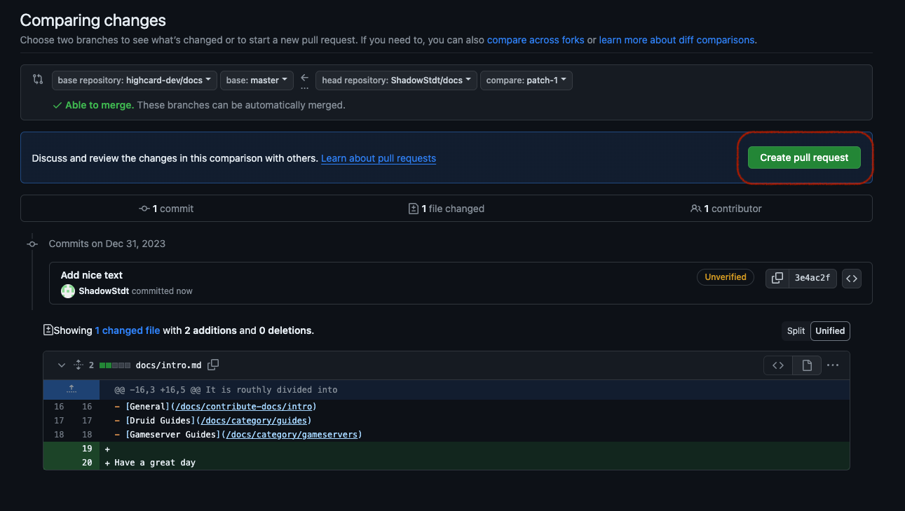
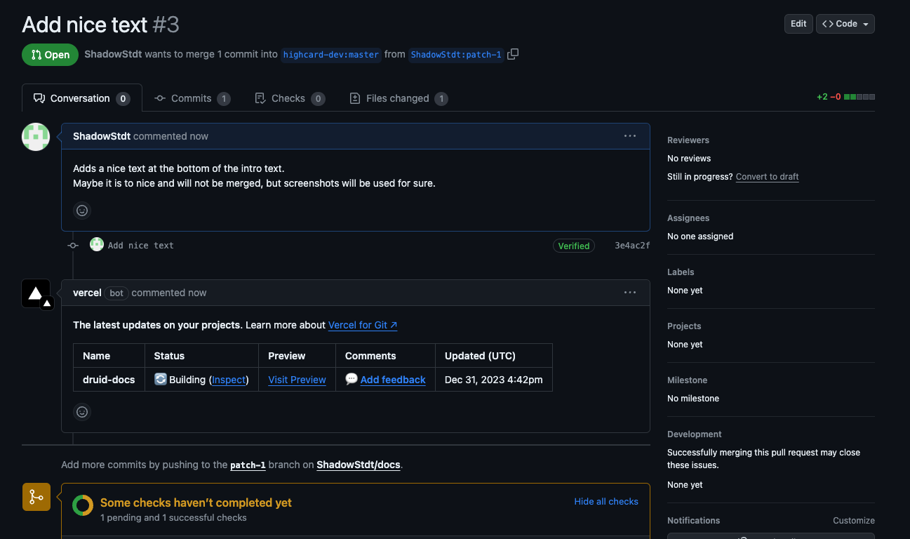
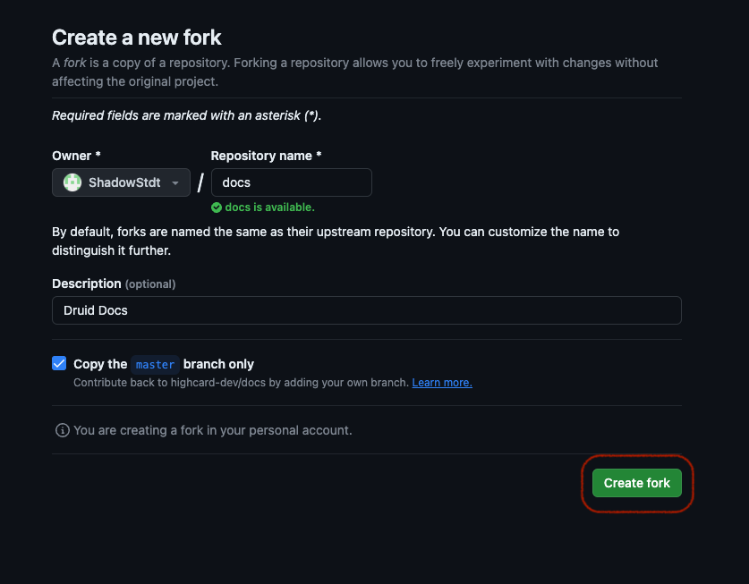

# Contribute to the docs.

If you want to contribute to the documentation, this necisiarrly requires an interaction with [our Git repository](https://github.com/highcard-dev/docs).
You don't have to be familiar with Git, to do this, eventhough it is recommended.
If you allready know about Git, the following guide is probably to detailed.

Consider also the [Helpful links edit the Documentation](#helpful-links-to-edit-the-documentation), to learn more about the tools, we use to run this documentation. It is also very helpful, if you want to improve your technical knowledge, as tools like Git, Github, Markdown etc. are widly used.

## Edit an existing page

### 1. Go to the page, you want to edit

Go to the page wich you want to change and click the link to edit at the bottom.

### 2. Login or sign up to Github

Now you need to log in to your Github account.

If you are allready logged in, you can skip this step.

If you don't have an account, you can [sign up here to github.com here](https://github.com/signup).

### 3. Fork a Repository

Now you need to create a fork of the druid docs repository to you Github account.

### 4. Edit

Now do the edit of the page. Every page is written in Markdown.
Markdown is a lightweight way to format a document to add images, text-styling, links, etc...
You can read more about Markdown here: [Markdown Guide](https://www.markdownguide.org/)
If you like it short, here is a cheatsheet: [Markdown Cheatsheet](https://www.markdownguide.org/cheat-sheet/)

### 5. Commit changes

Now you need to commit the changes, that you have done to the forked repository.

### 6. Create pull request

Now let's create a pull request. A pull request is a proposal to change the druid docs with your changes.
This will stay open until we take a look at your changes and either merge it or request changes.

## Create a doc page

There are multipe ways on how to add a new file. If you are familiar with git, you probably should clone the repo and make the changes localy.
If you are a beginner, just follow this guide. If you want to learn more, there are additional links below, where you can educate yourself about all the tools we are using in this documentation.

### 1. Fork docs repository

### 2. Add a file

Now you can see the full repository and navigate the folder structure.
Just navigate to the `/docs/` folder and you should see some `md`-files and more folders. They are representative of the strucure wich you can see in the docs.
Just go to the right folder and and select `Add file`

Now do the changes. For more details, see [step 5 of the previous guide](#4-edit).

Alternativly you can als upload a markdown-file, just make sure it ends with `.md`.

### 3. Commit changes for pull request

If you are done, you cann press commit.

**Important** Please select the checkbox below, wich says `Create a new branch for this commit and start a pull request`

### 4. Create pull request

Just follow [step 6 in the guide on how to edit a page](#6-create-pull-request) from here.

## Helpful links to edit the Documentation

### Github & Git

It is manditory to be signed up to contribute to the Druid Documentation.

[Git Documentation & Videos](https://git-scm.com/doc)

[Signup to Github](https://github.com/signup)

If you want to have a deeper look at those tools, this is also very helpful.
If you are interested in software development or other software related fields, those are definitly important tools.
[How to Contribute to an Open Source Project on GitHub](https://egghead.io/courses/how-to-contribute-to-an-open-source-project-on-github)

### Docusaurus

Docusaurus is an easy to use tool, to create and maintain documentations.
It is focused at developers, but makes it also easy for beginners to make contributions to open documenations.

It itself also has great docs:
[Docusaurus Documentation](https://docusaurus.io/)
