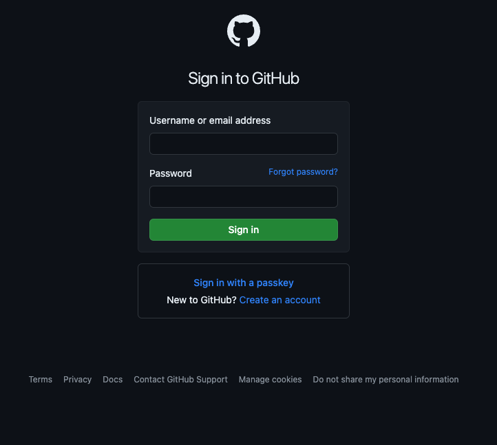
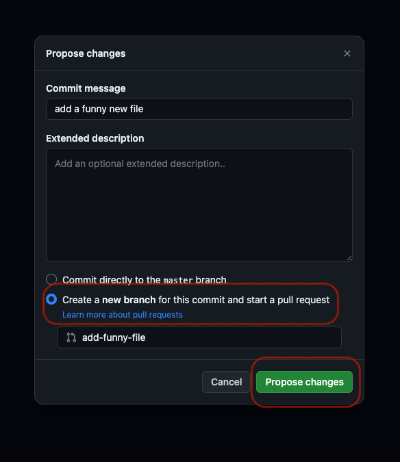

# Contributing to the documentation.

If you want to contribute to the documentation, you will need to interact with [our Git repository](https://github.com/highcard-dev/docs).
You don't need to be familiar with Git to do this, although it is recommended.
If you are familiar with Git, the following guide is probably too detailed.

Also see the [Helpful links to edit the documentation](#helpful-links-to-edit-the-documentation) to learn more about the tools we use to run this documentation. It is also very helpful if you want to improve your technical skills, as tools like Git, Github, Markdown, etc. are widely used.

## Editing an existing page

### 1. Go to the page you want to edit

Go to the page you want to edit and click the edit link at the bottom.

### 2. Log in or sign up to Github

Now you need to log in to your Github account.

If you are already logged in, you can skip this step.

If you don't have an account, you can [sign up here on github.com](https://github.com/signup).

### 3. Fork a repository

Now you need to fork the druid docs repository into your github account.

### 4. Editing

Now edit the page. Each page is written in Markdown.
Markdown is a lightweight way of formatting a document to add images, text styles, links, etc.
You can find out more about Markdown here: [Markdown Guide](https://www.markdownguide.org/)
If you like it short, here is a cheatsheet: [Markdown Cheatsheet](https://www.markdownguide.org/cheat-sheet/)

### 5. Commit changes

Now you need to commit the changes you have made to the forked repository.

### 6. Creating a pull request

Now let's create a pull request. A pull request is a proposal to change the druid docs with your changes.
This will remain open until we have looked at your changes and either merged them or requested changes.

## Creating a documentation page

There are several ways to add a new file. If you are familiar with git, you should probably clone the repo and make the changes locally.
If you are a beginner, just follow this guide. If you want to learn more, there are additional links below where you can learn about all the tools we use in this documentation.

### 1. Fork the docs repository

### 2. Add a file

Now you can see the whole repository and navigate the folder structure.
Just navigate to the `/docs/` folder and you should see some `md`-files and other folders. These are representative of the structure you can see in the docs.
Just go to the right folder and select `Add file`.

Now make the changes. See [Step 5 of the previous guide](#4-edit) for more details.

Alternatively you can upload a markdown file, just make sure it ends with `.md'.

### 3. Commit changes to the pull request

When you are finished, you can press commit.

**Important** Please tick the checkbox below that says `Create a new branch for this commit and start a pull request`.

### 4. Create the pull request

Just follow [step 6 in the guide to editing a page](#6-create-pull-request) from here.

## Helpful links for editing the documentation

## Github & Git

You must be logged in to contribute to the Druid documentation.

[Git Documentation & Videos](https://git-scm.com/doc)

[Sign up for Github](https://github.com/signup)

If you want to take a closer look at these tools, this is also very helpful.
If you are interested in software development or other software related fields, these are definitely important tools.
[How to contribute to an open source project on GitHub](https://egghead.io/courses/how-to-contribute-to-an-open-source-project-on-github)

### Docusaurus

Docusaurus is an easy-to-use tool for creating and maintaining documentation.
It is aimed at developers, but also makes it easy for beginners to contribute to open documentation.

It also has some great documentation itself:
[Docusaurus Documentation](https://docusaurus.io/)