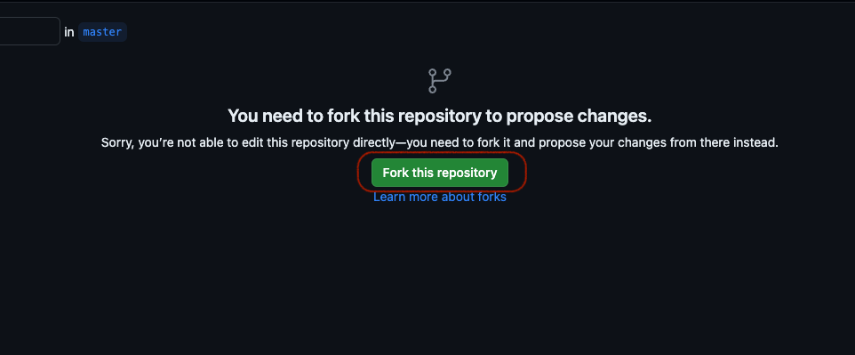
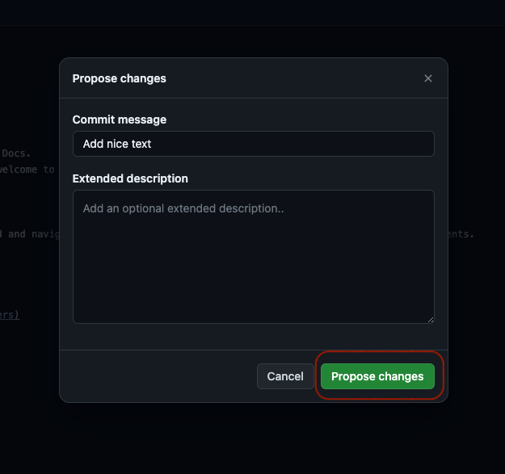
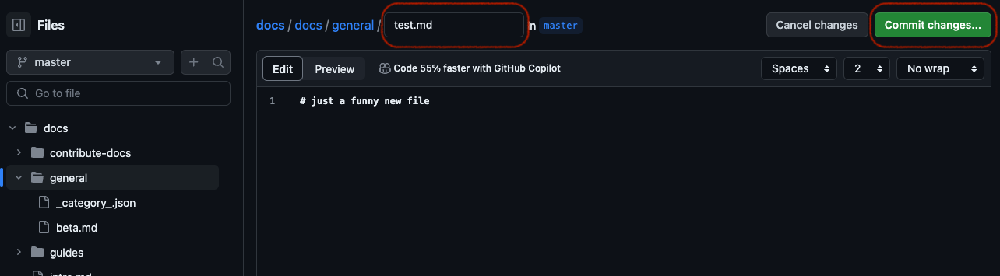

# Zur Dokumentation beitragen
---

Um zur Druid-Dokumentation beizutragen, interagiere einfach mit [unserem Git-Repository](https://github.com/highcard-dev/docs).  
Auch wenn Git-Kenntnisse hilfreich sind, sind sie nicht zwingend erforderlich.

Wenn du dich bereits mit Git auskennst, ist die folgende Anleitung wahrscheinlich zu detailliert.

Sieh dir auch [Hilfreiche Links zum Bearbeiten der Dokumentation](#hilfreiche-links-zum-bearbeiten-der-dokumentation) an, um mehr über die Werkzeuge zu erfahren, die wir zum Erstellen unserer Dokumentation verwenden.  

Es ist auch sehr hilfreich, wenn du deine technischen Kenntnisse verbessern möchtest, da Tools wie Git, GitHub, Markdown usw. häufig verwendet werden.

## Eine bestehende Seite bearbeiten
---

### 1. Seite auswählen

Wähle die Seite aus, die du bearbeiten möchtest, und klicke auf den Link zum Bearbeiten unten auf der Seite.

### 2. Bei GitHub anmelden

Melde dich bei deinem GitHub Konto an oder [erstelle ein neues Konto auf github.com](https://github.com/signup), falls du noch keines hast.

### 3. Repository forken

Erstelle einen Fork des Druid Dokumentations Repositories in deinem Account.

### 4. Bearbeiten

Nun kannst du die Seite direkt bearbeiten. Jede Seite wird in Markdown geschrieben.  

Markdown ist eine einfache Methode, um ein Dokument zu formatieren und Bilder, Text, Links usw. einzufügen.

Hier kannst du mehr über Markdown lesen: [Markdown Leitfaden](https://www.markdownguide.org/)  
Wenn du es kurz magst, findest du hier ein Cheatsheet: [Markdown Cheatsheet](https://www.markdownguide.org/cheat-sheet/)

### 5. Änderungen eintragen

Trage deine Änderungen ins Repository ein.

### 6. Pull Request erstellen

Erstelle einen Pull Request, um deine Änderungen vorzuschlagen. 

Ein Pull-Request ist ein Vorschlag, deine Änderungen zu den Druid Dokumenten hinzuzufügen.  

Er bleibt offen, bis wir deine Änderungen geprüft haben und sie entweder zusammenführen oder Änderungen anfordern.

## Eine Dokumentseite erstellen
---
Es gibt verschiedene Möglichkeiten, eine neue Datei hinzuzufügen.  

Wenn du mit Git vertraut bist, kannst du das Repository klonen und die Änderungen lokal vornehmen.  

Wenn du Anfänger bist, folge einfach dieser Anleitung.  
Wenn du mehr wissen möchtest, findest du unten [weitere Links](#hilfreiche-links-zum-bearbeiten-der-dokumentation), die dir helfen, mehr über die Werkzeuge zu erfahren, die wir in unserer Dokumentation verwenden.

### 1. Docs Repository forken

Erstelle zunächst einen Fork des Dokumentations Repositories.

### 2. Datei hinzufügen

Jetzt kannst du das gesamte Repository sehen und in der Ordnerstruktur navigieren.  

Navigiere einfach zum Ordner `/docs/`, und du solltest einige `md` Dateien sowie andere Ordner vorfinden. Diese repräsentieren die Struktur, die du in den Dokumentationen sehen kannst. Gehe einfach zum entsprechenden Ordner und wähle `Add file`.

In diesem Ordner kannst du nur Beiträge zur englischen Dokumentation leisten!

Für andere Sprachen navigiere bitte in den Ordner `/i18n/` und von dort in den Ordner der jeweiligen Sprache.

Nun kannst du die Änderungen vornehmen. Weitere Details findest du in [Schritt 4 der vorherigen Anleitung](#4-bearbeiten).

Alternativ kannst du auch eine Markdown Datei hochladen, achte aber darauf, dass sie mit `.md` endet.

### 3. Änderungen einreichen

Wenn du fertig bist, klicke auf Commit.

**Wichtig** Bitte aktiviere die Checkbox unten, die besagt: `Erstelle einen neuen Branch für diesen Commit und starte einen Pull Request`.

### 4. Pull Request erstellen

Folge ab hier einfach [Schritt 6 der Anleitung zum Bearbeiten einer Seite](#6-pull-request-erstellen).

## Hilfreiche Links zum Bearbeiten der Dokumentation
---

### GitHub & Git

- [Git Dokumentation & Videos](https://git-scm.com/doc)

- [Anmeldung für GitHub](https://github.com/signup)

- [Wie man zu einem Open Source Projekt auf GitHub beiträgt](https://egghead.io/courses/how-to-contribute-to-an-open-source-project-on-github)

Wenn du dich für Softwareentwicklung oder andere softwarebezogene Bereiche interessierst, sind diese Tools definitiv wichtig.

### Docusaurus

Docusaurus ist ein einfach zu bedienendes Werkzeug zur Erstellung und Pflege von Dokumentation.
Es richtet sich an Entwickler, macht es aber auch Anfängern leicht, zu offenen Dokumentationen beizutragen.

Docusaurus selbst hat auch sehr gute Dokumentationen: [Docusaurus Dokumentation](https://docusaurus.io/)