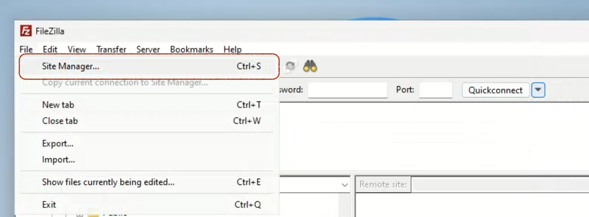
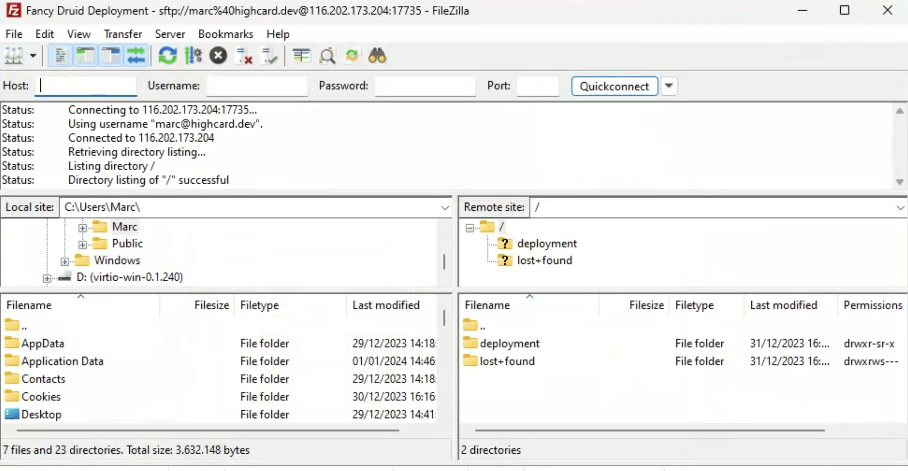

# Zugang zu deinen Serverdateien

Druid bietet mehrere Möglichkeiten, um alle Dateien deiner Mission hochzuladen und zu bearbeiten.
Du kannst das bekannte **FTP** oder das modernere HTTP-basierte **WebDAV**-Protokoll verwenden.

## FTP verwenden

FTP ist wahrscheinlich die bekannteste Methode, um mit entfernten Dateien zu interagieren.
Wir verwenden die Variante **Secure FTP oder SFTP**, die SSH verwendet, um Dateien verschlüsselt zwischen Server und Client zu übertragen.
Sie wird von allen gängigen FTP-Clients unterstützt.

Die SFTP-IP-Adresse und Port-Nummer kann im Druid-Deployment-Dashboard eingesehen werden:

**Wichtig:** Achte darauf, dass du in deinem FTP-Client das **SFTP-Protokoll** auswählst. (Siehe [Filezilla-Beispiel unten](#filezilla-example))

### Konto-Zugangsdaten

Der Benutzername und das Passwort für FTP sind die gleichen wie in der Druid-Anwendung.
**D.h. der Benutzername ist deine E-Mail-Adresse und das Passwort ist dein normales Passwort**.

### Filezilla Beispiel

Sehen wir uns kurz ein praktisches Beispiel an, wie man sich mit dem Filezilla FTP-Client verbindet.

#### 1. Öffne den Site Manager

#### 2. Konfiguriere die Verbindung

Hier ist es wichtig die folgenden Felder zu setzen:

- **Protocol:** SFTP - SSH File Transfer Protocol
- **Host:** _Host IP von Druid Dashboard_
- **Port:** _Host Port vom Druid Dashboard_.
- **Logon Type:** Wähle **Normal** um das Passwort auch auf dem Rechner zu speichern.
- **Benutzer:** Die E-Mail-Adresse, mit der du dich bei Druid angemeldet hast.
- **Passwort:** Das Passwort, mit dem du dich auch bei Druid einloggst.

#### 3. Anmelden!

Wenn du eine Meldung über die unbekannte Identität des Servers erhältst, drücke einfach **Ok**.

Danach solltest du verbunden sein. Wenn nicht, erscheint eine Fehlermeldung in der Filezilla-Konsole.
Normalerweise solltest du alle Dateien im Ordner **deployment** finden.

### Unterstützte FTP-Clients für jedes Betriebssystem

- [Filezilla](https://filezilla-project.org/download.php?type=client) - Weit verbreiteter FTP-Client

    - OS: Windows, Linux, MacOS

- [WinSCP](https://winscp.net/eng/downloads.php) - Auch sehr bekannt, aber nur für Windows

    - OS: Windows

- [Cyberduck](https://cyberduck.io/download/)

    - OS: Windows, MacOS

Man findet auch eine [sehr umfangreiche Liste bei Wikipedia](https://en.wikipedia.org/wiki/Comparison_of_FTP_client_software#Operating_system_support)

## WebDAV benutzen

Die Verwendung von WebDAV ist ähnlich wie die Verwendung von FTP, die Authentifizierung mit Benutzername und Passwort ist die gleiche.

Wenn du WebDAV in Betracht ziehst, bist du wahrscheinlich erfahrener und hast spezielle Bedürfnisse, es zu verwenden.
Im Allgemeinen kannst du den FTP-Leitfaden verwenden, du musst nur sicherstellen, dass du einen Client verwendest, der das WebDAV-Protokoll unterstützt.