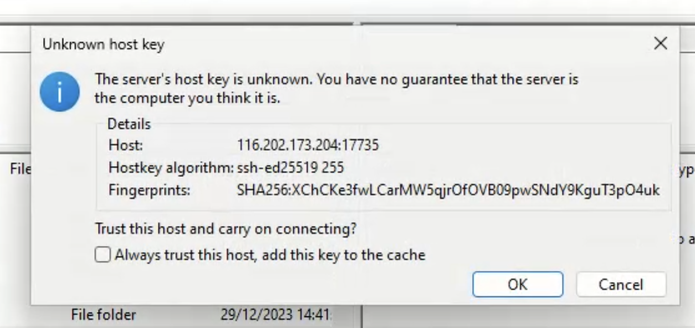

# Access your server files

Druid provides multiple ways to upload and edit all the files of your deployment.
You can use the very famous **FTP** or the more modern HTTP-based **WebDAV** protocol.

## Using SFTP

FTP is probably the most famous way to interact with remote files.
We are using the **secure FTP or SFTP** variation, wich uses SSH to transfer files encrypted between server and client.
It is supported by every major FTP client.

You can find you SFTP ip address and port number in the Druid deployment dashboard:

**Important:** Make sure you select the **SFTP-protocol** in you FTP client. (Compare to [Filezilla example below](#filezilla-example))

### Account Credentials

The username and password for FTP are the same as in the Druid app.
**This means the username is your email and the password just you normal password**

### Filezilla example

Let's have a quick look at a practical example on how to connect using the Filezilla FTP-client.

#### 1. Open the Site Manager

#### 2. Configure connection

Here it is important to set the following fields:

- **Protocol:** SFTP - SSH File Transfer Protocol
- **Host:** _Host Ip from Druid Dashboard_
- **Port:** _Host Port from Druid Dashboard_
- **Logon Type:** Select **Normal** to also save the password on your machine.
- **User:** The email address, you used to sign up for Druid.
- **Password:** The password you also use to log into the Druid App.

#### 3. Connect!

If you get promted about the unknown server identity, you can just press **Ok**.

After that you should be connected. If not error will be shown in the Filezilla console.
Usually you should find all your files in the **deployment**-folder.

### Supported FTP-clients for every OS

- [Filezilla](https://filezilla-project.org/download.php?type=client) - Very famous FTP client

  - OS: Windows, Linux, MacOS

- [WinSCP](https://winscp.net/eng/downloads.php) - Also widely use, but windows only

  - OS: Windows

- [Cyberduck](https://cyberduck.io/download/)

  - OS: Windows, MacOS

You can also find a [very comprehensive list on Wikipedia](https://en.wikipedia.org/wiki/Comparison_of_FTP_client_software#Operating_system_support)

## Using WebDAV

Using WebDAV is vers similar to using FTP, the username and password authentication is the same.

If you are considering WebDAV, you are probably more experienced and have a special need for using it.
Generally you can flow the FTP-guide, just make sure you use a client that supports the WebDAV protocol.
